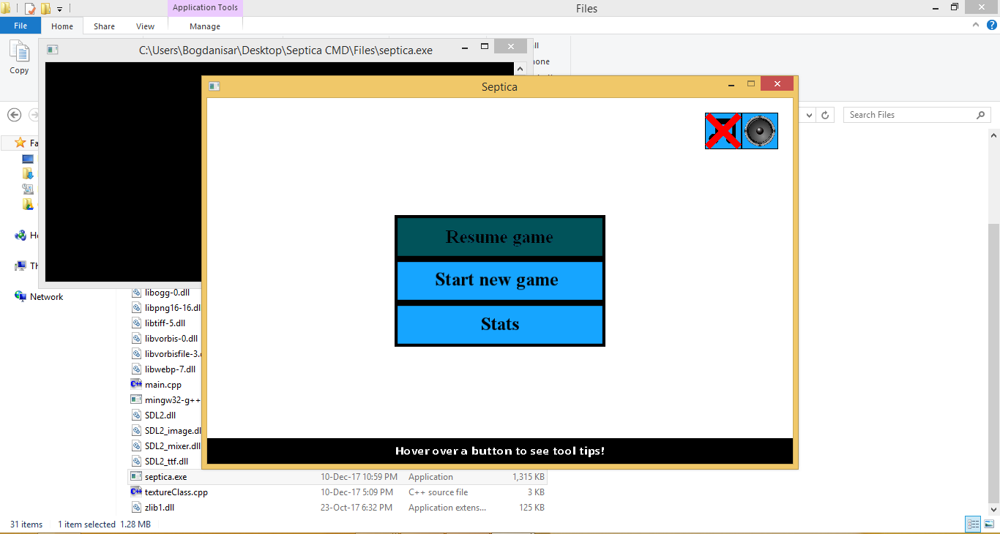
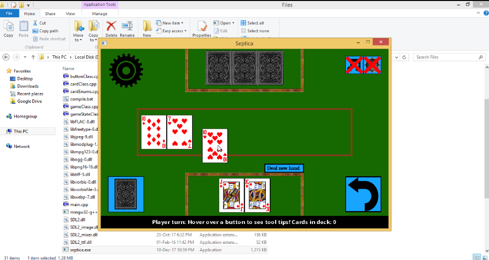
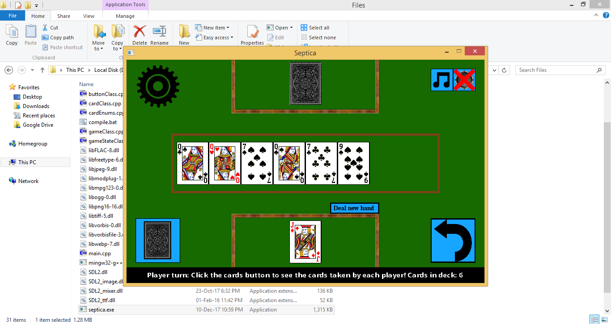
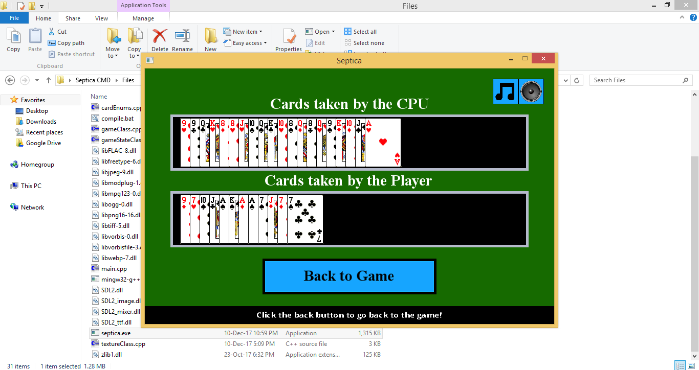
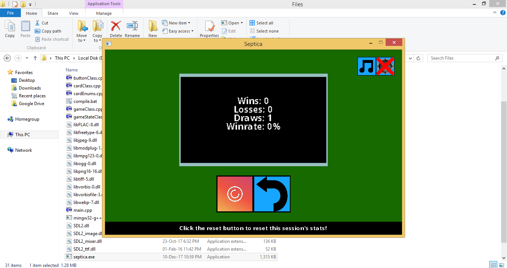

Septica is a romanian card game that needs at least 2 players.
Using this program, you can play a 1v1 game against an AI.
The game is implemented in C++ using the SDL 2.0 API in Windows.

In order to run the game follow the next steps:
1) Download the Game folder;
2) Run Game/septica.exe;

Screenshots: 

